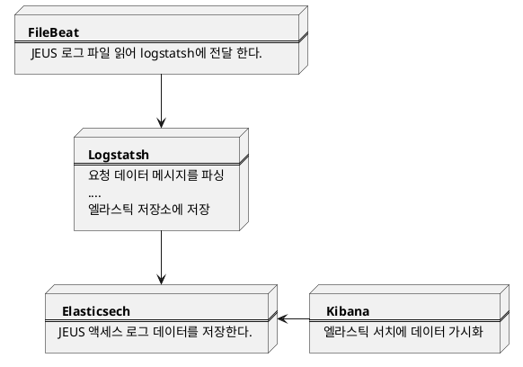

# 개발 노트 
```

PUT twitter 
{}

PUT cse_tx-2019-03-07/_mapping/type 
{
     "properties": {
       "ip": { "type": "ip" },
       "location" : { "type" : "geo_point" },
       "latitude" : { "type" : "half_float" },
       "longitude" : { "type" : "half_float" }
    }
}

GET cse_tx-2019-03-07/_mapping

- 지도 좌표를 그리고 싶어 연구 하던 중... 
https://www.elastic.co/guide/en/elasticsearch/reference/current/indices-put-mapping.html
https://www.elastic.co/guide/en/elasticsearch/reference/current/indices-get-mapping.html
https://www.elastic.co/blog/geoip-in-the-elastic-stack

- 템플릿
결국에는 정교한 컨트롤이 필요한 경우 템플릿 설정을 해야함 ㅠ.ㅠ.
세상에는 꽁짜는 없네 ㅠ.ㅠ  
https://www.elastic.co/guide/en/elasticsearch/client/java-rest/master/java-rest-high-put-template.html
```


